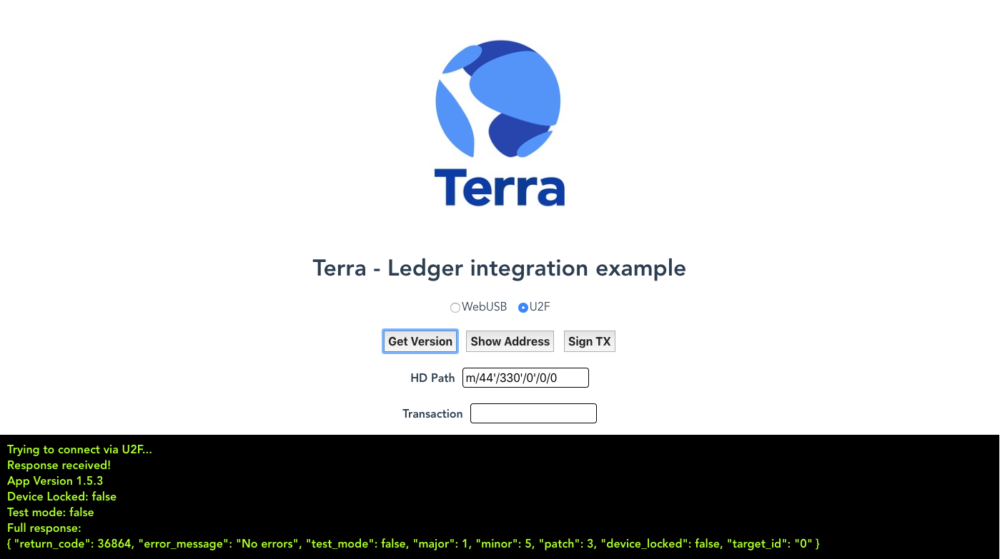

<<<<<<< HEAD
# ledger-terra-js

This package provides a basic client library to communicate with a Terra App running in a Ledger Nano S/X
=======
# ledger-cosmos-js

This package provides a basic client library to communicate with a Tendermint/Cosmos App running in a Ledger Nano S/X
>>>>>>> cee52c334407072d7d337487d0a0f9645c493cca

We recommend using the npmjs package in order to receive updates/fixes.

This repo also includes a simple Vue example for U2F and WebUSB.

<<<<<<< HEAD
**Note: WebUSB support requires Terra app >1.5.3**
=======
**Note: WebUSB support requires Cosmos app >1.5.3**
>>>>>>> cee52c334407072d7d337487d0a0f9645c493cca
